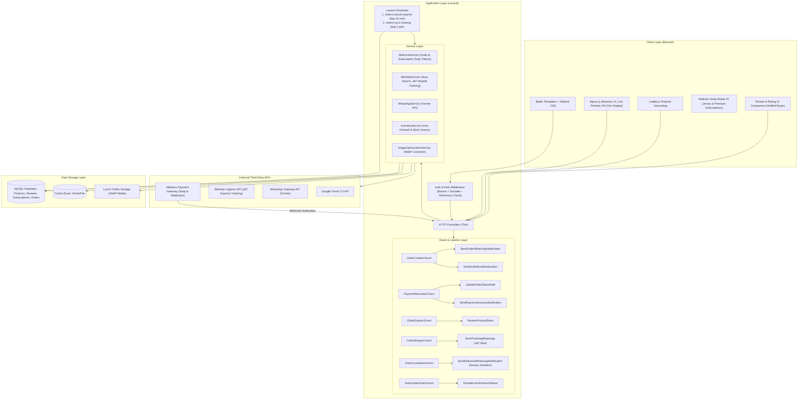

# 🏗️ System Architecture & Design
## Project: Ngizan Apparel
**Updated Date:** 2026-09-15

---

## 1. High-Level Architectural Pattern
**Ngizan Apparel** dibangun menggunakan pola **Service-Action & Event-Driven Architecture** di atas Laravel 12/13.



---

## 2. Service Layer & Directory Structure

```text
app/
├── Console/
│   └── Commands/
│       ├── CancelExpiredOrders.php      # Membatalkan pesanan expired & memulihkan stok
│       └── SyncJntTrackingCommand.php   # Auto-sync manifest J&T via Biteship & auto-complete pesanan
├── Enums/
│   ├── OrderStatus.php            # PENDING_PAYMENT, PAID, IN_PRODUCTION, SHIPPED, COMPLETED, CANCELLED, EXPIRED
│   ├── PaymentStatus.php          # PENDING, SETTLEMENT, EXPIRE, CANCEL, DENY
│   ├── StockReferenceType.php     # ORDER_PLACED, RESTOCK_EXPIRED, RESTOCK_CANCELLED, MANUAL_IN, MANUAL_OUT
│   ├── JerseySize.php             # S, M, L, XL, XXL, 3XL
│   └── JerseyType.php             # FANS_ISSUE, PLAYER_ISSUE, RETRO
├── Events/
│   ├── OrderCreated.php
│   ├── PaymentReceived.php
│   ├── OrderCancelled.php
│   ├── OrderExpired.php
│   ├── OrderShipped.php
│   ├── OrderCompleted.php
│   └── SubscriptionPaid.php
├── Listeners/
│   ├── SendOrderWhatsAppNotification.php
│   ├── SendOrderEmailNotification.php
│   ├── HandleMidtransStockRestore.php
│   ├── SendTrackingWhatsAppNotification.php
│   ├── SendOrderCompletedNotification.php
│   └── ActivateUserPremiumStatus.php
├── Models/
│   ├── User.php                   # Relasi hasMany(Review), hasMany(PremiumSubscription), is_premium check
│   ├── Product.php                # Relasi hasMany(Review), average_rating, final_price logic
│   ├── Review.php                 # Relasi belongsTo User, Product, Order (Verified Buyer)
│   ├── PremiumSubscription.php   # Riwayat langganan 100k/thn Midtrans
│   └── Order.php                  # Relasi belongsTo User, hasMany(OrderItem), hasOne(Payment), J&T waybill
├── Services/
│   ├── MidtransService.php         # Create Snap Token (Order & Premium Subscription), Verify SHA512 Signature
│   ├── BiteshipService.php         # Area Autocomplete, J&T Tracking Status API
│   ├── WhatsAppService.php         # Send Formatted WhatsApp Messages via Fonnte API
│   ├── InventoryService.php        # Reserve Stock, Deduct Stock, Restore Stock, Log Mutasi
│   └── ImageOptimizationService.php# Resize & Convert Images to .webp on Upload
```

---

## 3. Alur Logistik Kemitraan J&T Express & Auto-Tracking Status

1. **Gratis Ongkir Flat Rp 0**:
   * Seluruh pesanan di checkout otomatis terkunci menggunakan kurir **J&T Express** dengan `shipping_cost = 0`.
   * Form alamat pengiriman tetap menggunakan **Biteship Area Autocomplete** dan **Leaflet.js Pinpoint Geocoding** untuk mengunci koordinat `latitude`, `longitude`, dan `benchmark_notes` (patokan rumah) agar kurir J&T mengantar ke titik presisi.
2. **Admin Input Resi & Auto-Shipped**:
   * Setelah barang dikemas, Admin memasukkan nomor resi (waybill) J&T di dashboard backoffice.
   * Status pesanan seketika berubah menjadi `shipped` dan Fonnte WhatsApp otomatis mengirimkan resi ke pelanggan.
3. **Hybrid Auto-Tracking & Auto-Completed Engine**:
   * **Background Sync**: Command `php artisan orders:sync-tracking` dijalankan setiap 1 jam via Laravel Scheduler. Command ini mengambil semua pesanan berstatus `shipped`, memanggil tracking J&T via Biteship, dan jika status kurir adalah `delivered`, otomatis mengubah status pesanan menjadi `completed`.
   * **Live Fetch**: Saat pelanggan/admin membuka halaman detail pesanan, sistem langsung mengambil manifest perjalanan terkini dari API untuk ditampilkan pada timeline pelacakan.
   * **Review Trigger**: Setelah order berstatus `completed`, sistem membuka hak akses bagi pembeli untuk memberikan bintang (1-5) dan ulasan produk.

---

## 4. Alur & Logika Ngizan Premium Membership (Diskon 5%)

1. **Pembelian Langganan (Rp 100.000 / 365 Hari)**:
   * Customer menekan tombol "Gabung Premium" $\rightarrow$ Controller membuat `PremiumSubscription` $\rightarrow$ Midtrans Snap modal terbuka.
   * Setelah pembayaran terverifikasi via Webhook (`settlement`), listener mengupdate `users.is_premium = true` dan `users.premium_until = now()->addDays(365)`.
2. **Mesin Kalkulasi Harga Dinamis (Dynamic Pricing Engine)**:
   * Logika harga terpusat di `Product::getFinalPrice(?User $user)`:
     ```php
     public function getFinalPrice(?User $user = null): float
     {
         if ($user && $user->is_premium && $user->premium_until > now()) {
             return round($this->base_price * 0.95);
         }
         return (float) $this->base_price;
     }
     ```
   * Jika user login dan merupakan member aktif:
     * Kartu produk di katalog menampilkan harga asli dicoret dan harga 5% OFF dengan badge emas *"⭐ Member 5% OFF"*.
     * Di PDP, keranjang belanja, dan invoice checkout, subtotal produk langsung dipotong diskon 5%.
